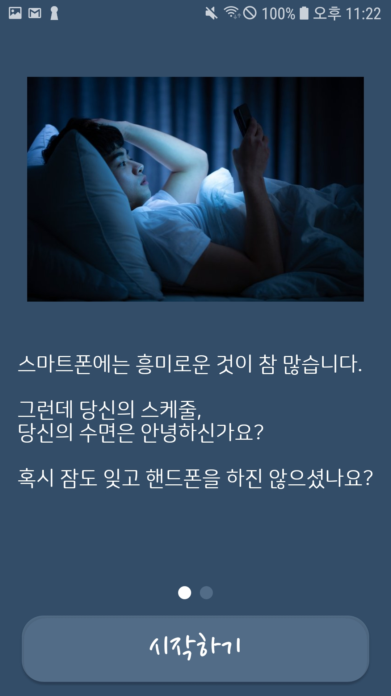
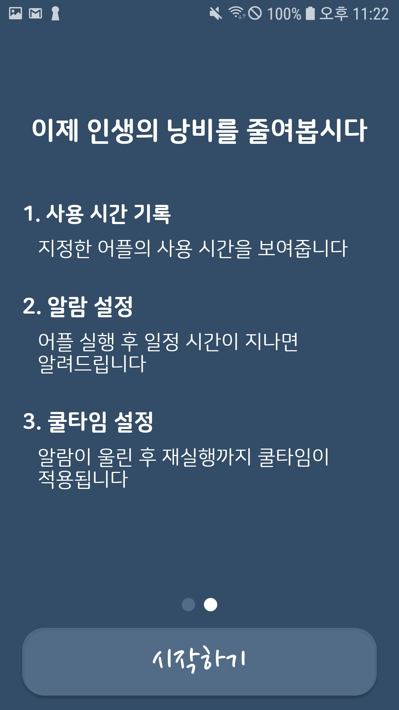
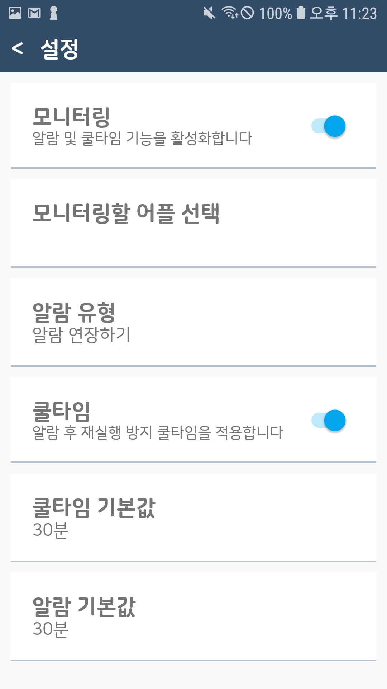
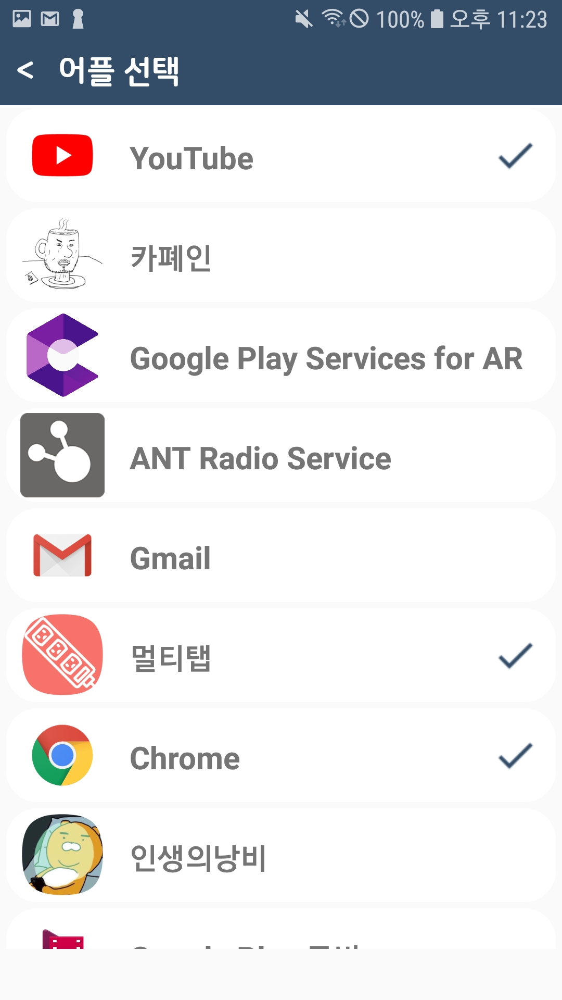
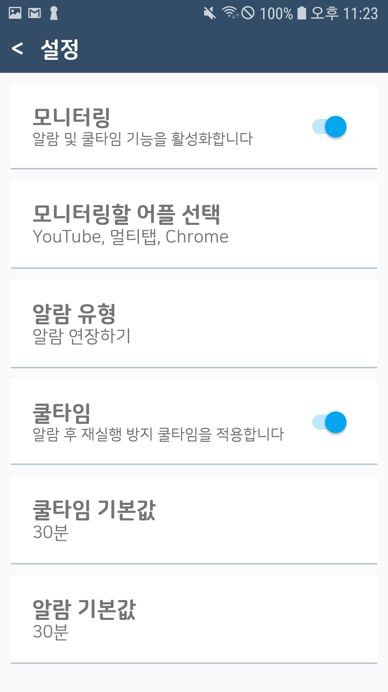
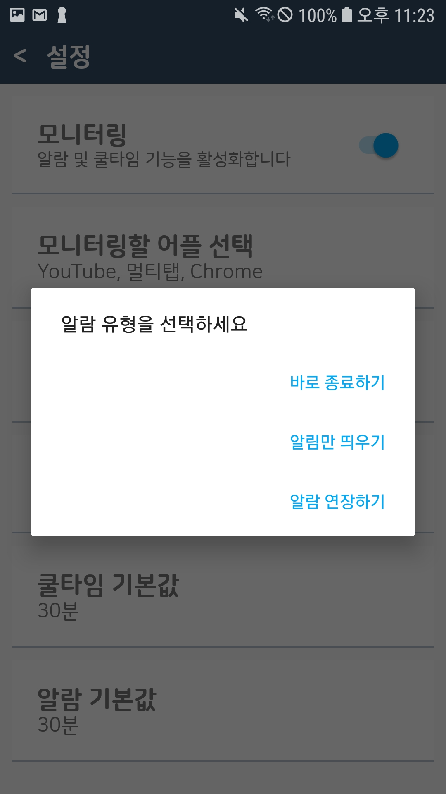
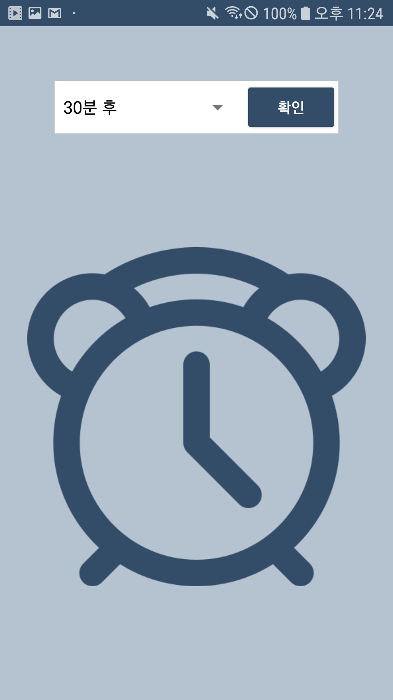
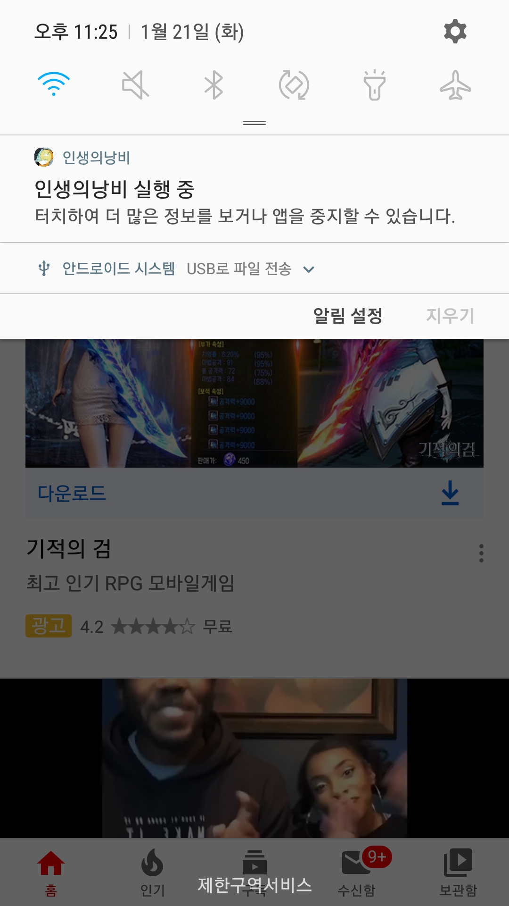
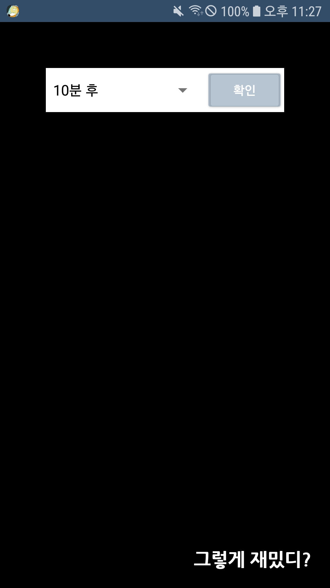
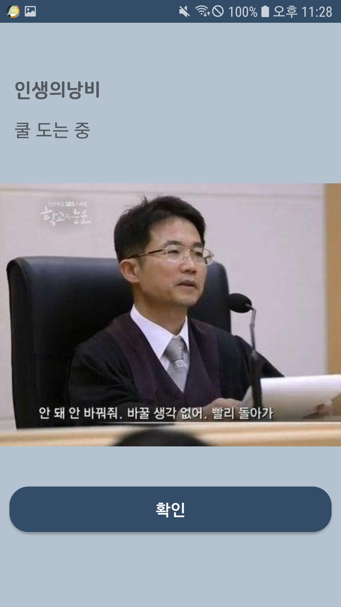

# MadCamp Week3 Project
A simple application that manages and notifies users to start working!

Made by 허경 and 조현준(https://github.com/HyunjoonCho)

## 핸드폰 사용시간 관리 앱
 - 메인 페이지에서는 하루동안 지정한 앱의 사용량을 볼 수 있으며 설정페이지에서 여러 앱을 monitoring 대상으로 지정할 수 있음
 - Foreground Service를 이용하여 사용자가 특정 앱을 사용할 경우, 알림을 띄워주고 사용시간을 정할 수 있음. 시간이 다되면 설정에 따라 앱을 끄거나, 다시 알림을 띄워주거나, head up 알림을 띄울 수 있음.

## 실행화면  

#### 로딩 및 최초 실행

  
   
  

#### 설정

  
   
  
  

모니터링할 어플 선택 하단에 선택된 어플리케이션들이 표시됩니다.   

#### 알람

   
  
    

설정한 시간이 될 경우, 앞서 선택한 알람 유형에 따라 화면이 표시되며 얼마나 더 사용할지 선택할 수 있습니다. 이때 상단 알림창에 어플리케이션이 동작 중임을 표시합니다. 

  
   

시간을 연장한 경우, 검은 화면과 함께 재연장 옵션이 표출되고 바로 종료를 선택한 경우 재실행을 막습니다.   
